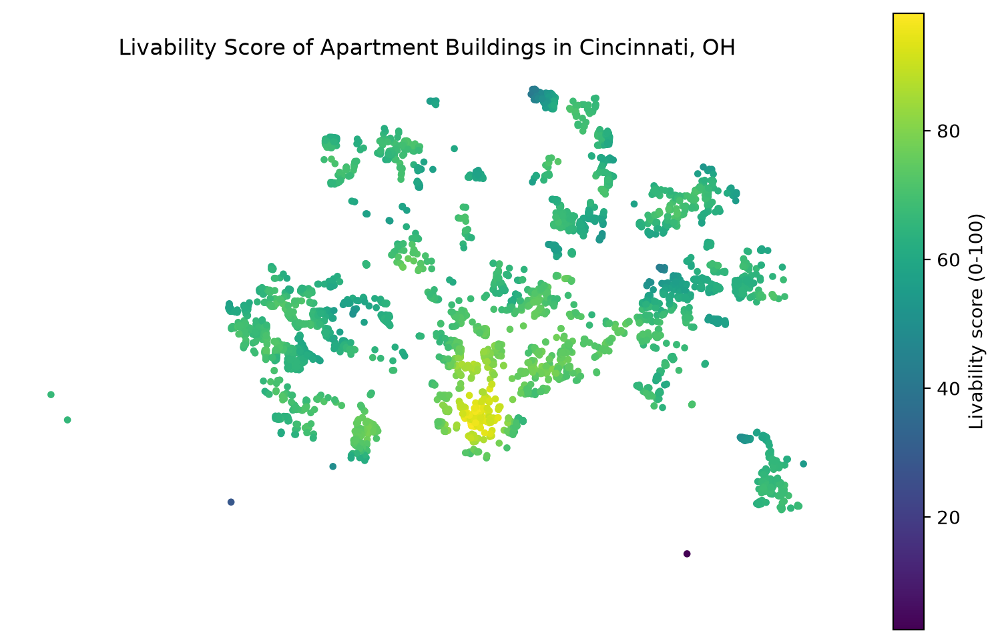

# Cincinnati Livability Index

A livability score for apartment buildings in Cincinnati, OH, built entirely from public OpenStreetMap data via [osmnx](https://github.com/gboeing/osmnx) and [GeoPandas](https://geopandas.org/).

## What it does

[`scripts/livability_score.ipynb`](scripts/livability_score.ipynb):

1. Downloads apartment building footprints (`building=apartments`) from OSM for Cincinnati and maps them interactively.
2. Downloads parks (`leisure=park`) and counts how many fall within a 1 km straight-line buffer of each building.
3. Downloads transit stops (`highway=bus_stop`, `railway=stop`/`station`/`tram_stop`) and schools (`amenity=school`), and computes each building's straight-line distance (in meters, UTM zone 16N) to the nearest one of each.
4. Normalizes each factor to a 0-100 scale and combines them into a single `livability_score` using explicit, adjustable weights (`FACTOR_CONFIG`):
   - `distance_to_transit_m` (lower is better): 0.35
   - `distance_to_school_m` (lower is better): 0.35
   - `parks_within_1km` (higher is better): 0.30
   - An equal-weighted `livability_score_equal` column and a Spearman rank correlation against it are included as a sensitivity check.
5. Saves the scored buildings to GeoPackage and GeoJSON.

## Outputs

`outputs/livability/`:
- `apartment_buildings_scored.gpkg` - all apartment buildings with every raw factor, its normalized (`_norm`) column, `livability_score`, and `livability_score_equal`.
- `apartment_buildings_scored.geojson` - the same data in EPSG:4326.
- `livability_score_map.png` - a static choropleth of `livability_score` by building.

## Running it

Requires Python with `osmnx`, `geopandas`, `pandas`, `matplotlib`, and `folium` (all available via conda-forge). Open `scripts/livability_score.ipynb` and run all cells - it re-downloads data from OpenStreetMap and re-derives everything in `outputs/`.

## Data source

All input data is © [OpenStreetMap](https://www.openstreetmap.org/copyright) contributors, available under the [Open Database License](https://opendatacommons.org/licenses/odbl/).
